<picture>
  <source media="(prefers-color-scheme: dark)" srcset="assets/banner-dark.svg">
  
</picture>

# Azurer0121

**AI tooling · developer tools · desktop apps**

构建 AI 工具链与开发者工具，偏向本地优先、可组合的桌面与命令行体验。
Building AI tooling and developer tools, with a bias toward local-first, composable desktop and CLI experiences.

## Currently building · 正在做的事

围绕 [DeepSeek Harness](https://github.com/deepseek-ai/deepseek-harness) 的插件生态做开发 —— 这是一个「一切皆插件」（everything is a plugin）的 agent harness。目前的重心是把模型能力接到真实的工作环境上：远程执行、连接持久化、与本地工作区的绑定。

Currently building plugins for DeepSeek Harness, an agent harness built around an "everything is a plugin" architecture. The focus is wiring model capabilities into real working environments: remote execution, persistent connections, and workspace binding.

## Featured projects · 精选项目

### [`dsh-ssh-plugin`](https://github.com/Azurer0121/dsh-ssh-plugin)

DeepSeek Harness 插件，为模型提供 `ssh_exec` 工具在远程服务器上执行命令，并把 **SSH 连接持久化**：保存一次、绑定到工作区，之后 `ssh_exec` 默认复用该连接。

- 仅使用密钥认证（`BatchMode=yes`），密钥缺失或未授权时立即失败，而不是挂起等待输入
- 识别本地 `~/.ssh/config`，其中的 Host 别名无需手动保存，直接作为 `host` 传入即可
- 工作区默认连接：`ssh_connections use` 绑定后，`ssh_exec` 可以省略 `host`

A DeepSeek Harness plugin adding the `ssh_exec` tool plus **persisted SSH connections** — save a connection once, bind it to a workspace, and let `ssh_exec` reuse it by default.

### [`MDreader`](https://github.com/Azurer0121/MDreader)

离线优先的本地 Markdown 阅读器，基于 Tauri + React + Milkdown，支持 Windows 与 macOS Apple Silicon，界面借鉴 Typora 的克制阅读体验。

- 离线优先、跨平台：不依赖网络，桌面端原生打包
- CommonMark + GitHub Flavored Markdown，表格、任务列表、代码块与语法高亮
- Milkdown 所见即所得编辑，原地保存，保存前有未保存修改确认
- 配置了 `.md` / `.markdown` / `.mdown` 文件关联，可直接交给 MDreader 打开

An offline-first local Markdown reader for Windows and macOS Apple Silicon, with in-place editing and Markdown file association.

### [`deepseek-harness-azurer`](https://github.com/Azurer0121/deepseek-harness-azurer)

围绕 DeepSeek Harness 的插件化架构与 AI 工具链生态的个人工作仓库。该 harness 由 [DeepSeek AI](https://deepseek.com) 开源开发并处于 developer preview，本仓库是围绕它的插件实践与集成工作。

A personal working repo around the plugin architecture and tooling ecosystem of DeepSeek Harness — the harness itself is an open-source project by [DeepSeek AI](https://deepseek.com).

## Tech stack · 技术栈

| 领域 / Area | 使用中 / In use |
| --- | --- |
| 语言 / Languages | TypeScript · Rust · C |
| 运行时与框架 / Runtime & frameworks | Node.js · React · Vite |
| 桌面 / Desktop | Tauri（Windows、macOS Apple Silicon） |
| AI 工具链 / AI tooling | DeepSeek Harness 插件、agent 工具与工作区集成 |
| 文档与编辑 / Docs & editing | Markdown · GFM · Milkdown |

## Contribution activity · 贡献动态

该图由本仓库的 GitHub Actions 每日重新生成。

## Contact · 联系方式

这里暂不放置邮箱或社交账号。技术讨论、问题反馈与合作意向，欢迎通过对应仓库的 Issues 提出，或在本仓库开启一个 Discussion。

No email or social handles are listed here. For technical discussion, bug reports, or collaboration, please open an issue on the relevant repository or start a discussion in this one.